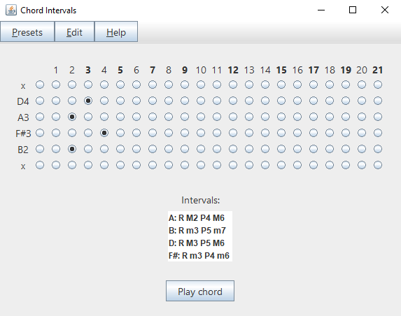
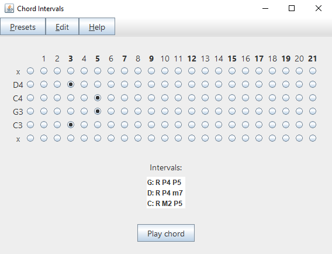

# chord-intervals

This tool is a GUI that models a guitar (or any other stringed instrument) fretboard. When you enter a chord shape, it tells you what notes are being played and what intervals are formed between them. This will help you visualize the relationship between the notes on your fretboard and identify the chords you play. While it does not name the chords per se, figuring this out by yourself will give you a far better grasp on basic music theory.

I wanted to make chord-intervals customizable, as there are other similar tools online (some of which even handle chord naming). You can add and remove strings and frets, customize your tuning at will (within 12-tone equal temperament) - even specify the fret marks if you like. You can then save your modifications as an instrument preset and load it at any time. The tool already has lots of stock presets, including open tunings, extended-range guitars, bass and ukulele.

## Running

This is a Java 8 project in Eclipse and uses the Swing GUI toolkit. I included a stand-alone [.jar file](chord-intervals.jar) which you can run right away if you have Java installed.

## Simple use cases

Bm7 has all the same notes as D6, therefore we can interpret it as an inversion of the latter - D6/B. In the right context, m7 chords can sound mellow and neutral, because they fluctuate between a minor and a major tonality.

\

Along with being neither minor or major, every sus2 chord is also an inversion of a sus4 chord (in this example Csus2 can be interpreted as Gsus4/C), hence their ambiguous quality.

